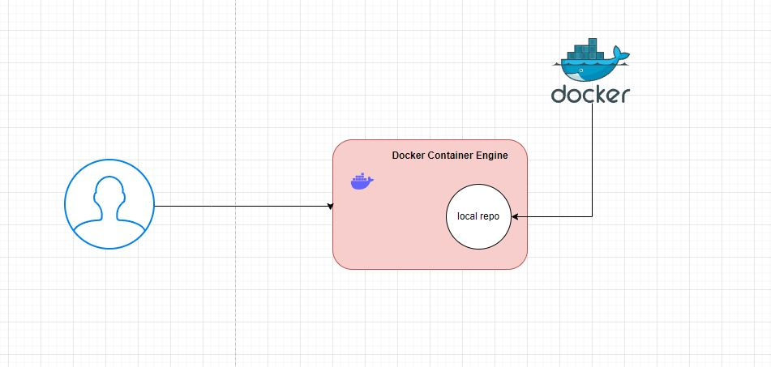

Docker image == Bare minimum OS + App run time + system packages and dependencies + App code = image
Docker container == running instance of image is called container.

To install docker on RHEL

* sudo yum install -y yum-utils
* sudo yum-config-manager --add-repo https://download.docker.com/linux/rhel/docker-ce.repo
* sudo yum install docker-ce docker-ce-cli containerd.io docker-buildx-plugin docker-compose-plugin
* sudo systemctl start docker
* systemctl status docker
* systemctl enable docker 

some docker we need to run--- come out of root and run them
when docker is installed, it will create docker group.Users who r in docker group or root user can only run docker commands 
* usermod  -aG docker ec2-user--> to add user to secondary group usermod -aG <group name> <username>
then logout of system and then login to run docker commands

* docker ps ----> it will show running containers
* docker ps -a ---> all containers with any status
* docker images ---> list down the images
* docker pull nginx ---> to take images from docker hub
* username, image name and version ----> TAG is version
* docker pull alpine --->OS which is less than 10 MB
* docker pull nginx:alpine
* docker create <image>:tag ---> to create container from image
* docker start <container id>---> container will start running
* * docker run  = docker pull + docker create + docker run  * *
* docker rm -f <container id> --> to stop running containers forcefully
* docker stop <container id> ---> to stop running container
* docker rmi <image id>---> to delete image
* docker rmi `docker images -a -q`---> to delete all images
* docker rm `docker ps -a -q` ---> to delete all containers
* docker run nginx ---> this runs in foreground
* docker run -d nginx ---> to run in background (also called detach mode)
* docker run -d <image id> ---> to run in background

server has 65535 ports, even docker container has 65535 ports.
How can you access docker container from internet?
By enabling the port, we need to open host port that can redirect traffic to container.

docker run -d -p <host-port>:<container-port>
docker run -d -p 80:80 nginx --->host port our wish ---> container port is fix
* ex: docker run -d -p 8000:80 nginx--->if we do <aws instance ip address:8000> -->we get access 

docker logs <container id> ---> to see logs of container 
docker logs -f <container id> ---> -f is follow the logs of container 
docker inspect <container id> ---> we will get full information of container 
docker inspect <image id> ---> to get information of image 
docker exec -it <container id> bash (execute interactive terminal)---> 

* Docker file 
It is declarative way of creating custom images. keep all the instructions in a file (i.e docker file) and build the image.

docker build -t url/username/image-name:tag . ( dot represents current directory. by default docker build command checks for docker file)

* instructions

FROM:
from should be the first instruction to represent base OS
FROM image-name:tag

docker build -t FROM:1.0 .

RUN:
we will use RUN instruction to install packages and configure them. RUN instruction will execute at the time of image creation.

CMD:
This instruction will run at the time of container creation.

systemctl start backend --> then only you can access backend application.
whatever the instruction you give in image to run as container,should run for infinite time.

there should be only one CMD instruction.

LABEL:
This instruction is used for filtering. 
docker images -f label=course=devops

EXPOSE:
expose instruction will let the users know what are the ports used by image or container.This instruction does not have any functionality. This does not open the port.This is used only for informational purpose.

docker inspect <image id>  ---> shows exposed ports.

How to push image to docker hub?
you can push images to docker hub, nexus, ECR, jfrog etc
url/username/image-name:tag

docker push leelakamineni/label:1.0

docker tag label:1.0 joindevops/label----> retagging

docker login---> give username and password for pushing

docker pull joindevops/label:v1.0.0 ---> for pulling the image

ENV:

COPY vs ADD
COPY and ADD both are to copy the files from workspace to docker image. but add have two extra advantages.
1. It can directly download the content from internet into the image
2. It can directly untart the files into the image 

ENTRYPOINT:
CMD instruction can be overridden.
docker ps -a --no-trunc ---> gives all info without cut.
same instruction trying to override with ENTRYPOINT is not working.you cant override ENTRYPOINT, if you try to do it will go append and we get error. 

CMD VS ENTRYPOINT:
you can mix cmd and entrypoint for better results. CMD is used to supply default arguments to ENTRYPOINT.
we can always override default args from runtime.
As CMD instruction can be overridden. we can give docker run entrypoint:1.0.0 yahoo.com and container will ping yahoo.com.

USER:
Bestpractices: we should not let containers run with root access

WORKDIR:
if we give cd in run instruction it will not work. so we can set working directory using WORKDIR instruction.

ARG:
1. ARG can be first instruction in only one case.It can be used to supply the version for FROM instruction.
2. You can have args in Dockerfile, you can supply the values through command through option --build-args
3. you can always have default values to arg and override if required.

ENV vs ARG
1. ENV variables can be accessed both at the build time and run time of containers.
2. ARG instruction can only be accessed at the time of build or image 

How can i access arg inside container?

